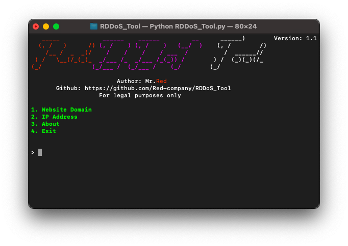
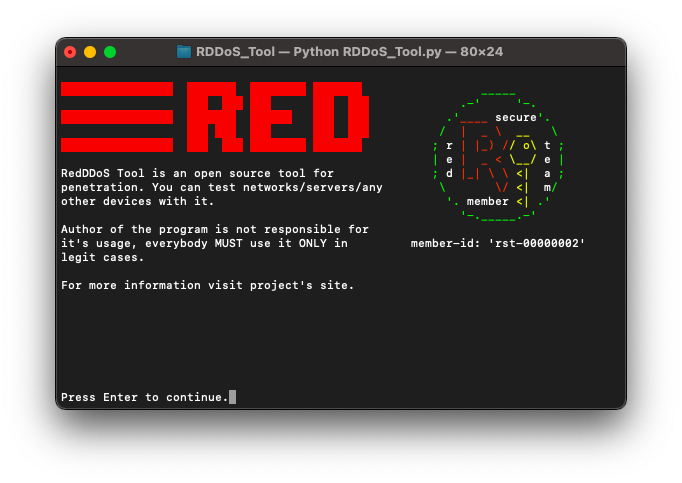
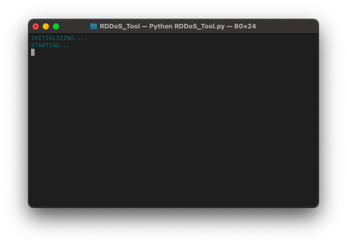
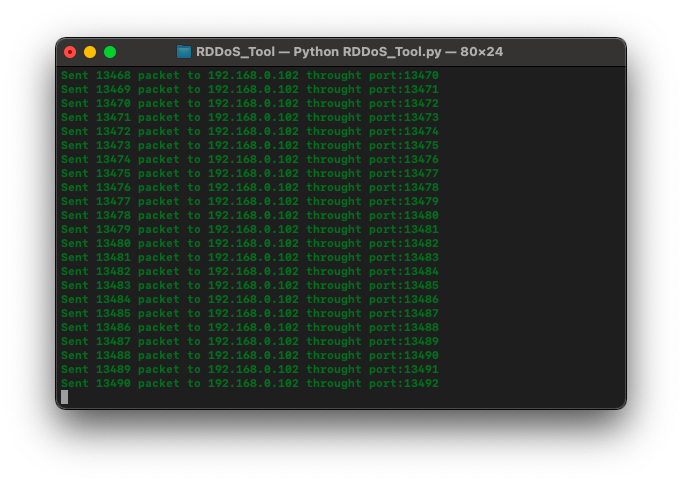

# 🔫 Red DDoS Tool (توزيع ريد لأداة رفض الخدمة)  



## What is RedDDoS Tool?
 RedDDoS Tool is a tool for penetration. You can test networks/servers/any other devices with it.

## How it Works? 
 It sends continuous packets to the target. This attack is known as DDoS attack.

## What is DDoS Attack?
  <p>In a Distributed Denial-of-Service attack (DDoS attack), the incoming traffic flooding the victim originates. This effectively makes it impossible to connect to an other device.</p>

## Supported Devices:
 This program is supported in all operating system like Linux, Windows and MacOs. The Code is written in python3, so Dont worry it works well without any bugs.

## Installing (Windows/Linux/MacOs/Termux):
```
apt-get update -y
apt-get install git
git clone https://github.com/Red-company/RDDoS_Tool.git
cd RDDoS_Tool
bash setup.sh
python3 RDDoS_Tool.py
```

## One line Installation:
```
apt-get update -y && apt-get install git && git clone https://github.com/Red-company/RDDoS_Tool.git && cd RDDoS_Tool && bash setup.sh && python3 RDDoS_Tool.py
```

## Errors? Troubleshooting is here:
If it's about libraries, just write these strings:
```
pip install tqdm
pip install pyfiglet
```

## Screenshots? Here they are:








##
All material in this repository is in the public domain.
